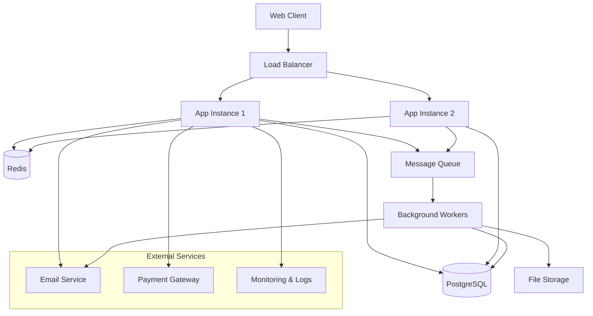

# Development Standards Pack - Complete Guide

_Generated: 2025-08-09_

## Table of Contents

1. [Overview](https://claude.ai/chat/875a2df9-f007-4a35-9ac3-b3f68689a057#overview)

2. [Security Baseline](https://claude.ai/chat/875a2df9-f007-4a35-9ac3-b3f68689a057#security-baseline)

3. [Getting Started Guide](https://claude.ai/chat/875a2df9-f007-4a35-9ac3-b3f68689a057#getting-started-guide)

4. [Coding Standards](https://claude.ai/chat/875a2df9-f007-4a35-9ac3-b3f68689a057#coding-standards)

   * [Bash Scripting](https://claude.ai/chat/875a2df9-f007-4a35-9ac3-b3f68689a057#bash-scripting-standards)
   * [PHP (Laravel)](https://claude.ai/chat/875a2df9-f007-4a35-9ac3-b3f68689a057#php-laravel-coding-standards)
   * [Python (FastAPI)](https://claude.ai/chat/875a2df9-f007-4a35-9ac3-b3f68689a057#python-fastapi-coding-standards)
   * [Node.js (Fastify)](https://claude.ai/chat/875a2df9-f007-4a35-9ac3-b3f68689a057#nodejs-fastify-coding-standards)
   * [React/Next.js](https://claude.ai/chat/875a2df9-f007-4a35-9ac3-b3f68689a057#reactnextjs-standards)
   * [Vue/Nuxt](https://claude.ai/chat/875a2df9-f007-4a35-9ac3-b3f68689a057#vuenuxt-standards)
   * [HTML](https://claude.ai/chat/875a2df9-f007-4a35-9ac3-b3f68689a057#html-standards)
   * [CSS](https://claude.ai/chat/875a2df9-f007-4a35-9ac3-b3f68689a057#css-standards)
   * [SQL](https://claude.ai/chat/875a2df9-f007-4a35-9ac3-b3f68689a057#sql-standards)

5. [Security Implementation](https://claude.ai/chat/875a2df9-f007-4a35-9ac3-b3f68689a057#security-implementation)

   * [SELinux Setup](https://claude.ai/chat/875a2df9-f007-4a35-9ac3-b3f68689a057#selinux-installation--activation-guide)
   * [AppArmor Setup](https://claude.ai/chat/875a2df9-f007-4a35-9ac3-b3f68689a057#apparmor-installation--activation-guide)
   * [ModSecurity/WAF Setup](https://claude.ai/chat/875a2df9-f007-4a35-9ac3-b3f68689a057#modsecurity--owasp-crs-setup-guide)

6. [Server Configurations](https://claude.ai/chat/875a2df9-f007-4a35-9ac3-b3f68689a057#server-configurations)

   * [Nginx Hardened Config](https://claude.ai/chat/875a2df9-f007-4a35-9ac3-b3f68689a057#nginx-hardened-configuration)
   * [Apache Hardened Config](https://claude.ai/chat/875a2df9-f007-4a35-9ac3-b3f68689a057#apache-hardened-configuration)
   * [HAProxy Hardened Config](https://claude.ai/chat/875a2df9-f007-4a35-9ac3-b3f68689a057#haproxy-hardened-configuration)
   * [Traefik Hardened Config](https://claude.ai/chat/875a2df9-f007-4a35-9ac3-b3f68689a057#traefik-hardened-configuration)

7. [Database Security](https://claude.ai/chat/875a2df9-f007-4a35-9ac3-b3f68689a057#database-security)

   * [PostgreSQL Lockdown](https://claude.ai/chat/875a2df9-f007-4a35-9ac3-b3f68689a057#postgresql-lockdown)
   * [MariaDB Lockdown](https://claude.ai/chat/875a2df9-f007-4a35-9ac3-b3f68689a057#mariadb-lockdown)
   * [Database TLS Setup](https://claude.ai/chat/875a2df9-f007-4a35-9ac3-b3f68689a057#database-lockdown--tls-enforcement)

8. [Security Profiles](https://claude.ai/chat/875a2df9-f007-4a35-9ac3-b3f68689a057#security-profiles)

   * [SELinux Policies](https://claude.ai/chat/875a2df9-f007-4a35-9ac3-b3f68689a057#selinux-policies)
   * [AppArmor Profiles](https://claude.ai/chat/875a2df9-f007-4a35-9ac3-b3f68689a057#apparmor-profiles)

9. [Utility Scripts](https://claude.ai/chat/875a2df9-f007-4a35-9ac3-b3f68689a057#utility-scripts)

   * [Environment Loader](https://claude.ai/chat/875a2df9-f007-4a35-9ac3-b3f68689a057#environment-loader-script)
   * [Self-Signed Certificates](https://claude.ai/chat/875a2df9-f007-4a35-9ac3-b3f68689a057#self-signed-certificate-script)

10. [ModSecurity Configuration](https://claude.ai/chat/875a2df9-f007-4a35-9ac3-b3f68689a057#modsecurity-configuration)

11. [Monitoring & Logging](https://claude.ai/chat/875a2df9-f007-4a35-9ac3-b3f68689a057#monitoring--logging)

12. [Backup & Recovery](https://claude.ai/chat/875a2df9-f007-4a35-9ac3-b3f68689a057#backup--recovery)

13. [Development Environment](https://claude.ai/chat/875a2df9-f007-4a35-9ac3-b3f68689a057#development-environment)

14. [Testing Standards](https://claude.ai/chat/875a2df9-f007-4a35-9ac3-b3f68689a057#testing-standards)

15. [Documentation Standards](https://claude.ai/chat/875a2df9-f007-4a35-9ac3-b3f68689a057#documentation-standards)

16. [Compliance & Audit](https://claude.ai/chat/875a2df9-f007-4a35-9ac3-b3f68689a057#compliance--audit)

***

## Overview

This pack contains the complete coding standards, security baselines, hardened configurations, and operational scripts as agreed and locked-in.

### Contents

* Language/framework-specific coding standards
* Security baseline and SELinux/AppArmor profiles
* Hardened web server and reverse proxy configs
* Database lockdown SQL scripts
* WAF rulesets (ModSecurity + OWASP CRS base config)
* Utility scripts for environment loading and TLS cert generation
* VS Code + Continue.dev integration guide

All files are production-ready with placeholders, inline documentation, and examples.

### Usage

* Store in `/docs/standards/` in your repo
* Reference relevant `.md` files in each project's CONTRIBUTING.md
* Use provided configs and scripts as starting points, customising placeholders

***

## Security Baseline

**Universal security requirements that apply to all projects:**

* Always HTTPS
* HSTS enabled
* TLS 1.2/1.3 only
* mTLS for internal APIs
* Firewall default-deny
* Least privilege for all accounts
* CSP, CORS locked down

***

## Getting Started Guide

Follow this order when setting up a new environment:

1. **Read this complete guide** fully

2. **Security Hardening**:

   * Apply SELinux/AppArmor profiles
   * Follow install guides for SELinux and AppArmor

3. **Database Lockdown**:

   * Choose PostgreSQL or MariaDB scripts
   * Apply TLS certificates and enforce secure connections

4. **Web Application Firewall (WAF)**:

   * Install and configure ModSecurity + OWASP CRS
   * Integrate into chosen web server (Nginx, Apache)

5. **Web Server / Reverse Proxy**:

   * Use hardened configs (Apache, Traefik, HAProxy)
   * Apply security headers, TLS settings, and rate limiting

6. **Language / Framework Standards**:
   * Follow coding standards for your stack

7. **Environment Variables**:

   * Place `.env` outside web root
   * Use environment loader to securely load

8. **Certificates**:
   * For testing, use self-signed certificate script

9. **VS Code Integration**:
   * Setup Continue.dev integration

***

## Coding Standards

### Bash Scripting Standards

* Start scripts with `#!/usr/bin/env bash`
* `set -euo pipefail` in all scripts
* Functions over inline blocks
* Validate all inputs
* Use `mktemp` for temp files
* Store logs in `/var/log/<scriptname>.log` JSON formatted when applicable

### PHP (Laravel) Coding Standards

#### Framework

* All PHP web applications MUST use Laravel
* CLI scripts may use plain PHP with the secure PHP bootstrap provided

#### Security

* Enforce CSRF, XSS, and SQLi protection (built-in)
* Use Laravel FormRequest for validation
* HTTPS enforced in middleware
* Secrets in `.env` **outside web root**. Use provided `load_env.sh`

#### Structure

* PSR-12 coding style
* One class per file; namespaces match folder structure

#### Logging

* Laravel logging driver set to JSON
* One log file per module in `log/<project>/<module>.log`
* Log rotation via logrotate

#### Database

* Use Eloquent ORM
* All connections over TLS

#### Documentation

* Every controller, model, and service has docblocks
* Per-file `.md` in `/docs` with Mermaid diagrams

#### Extract-to-library

* Mark reusable code with: `// @library-candidate: <description>`

### Python (FastAPI) Coding Standards

#### Security

* Use Pydantic models for request/response validation
* JWT authentication by default; Keycloak OIDC for enterprise
* HTTPS only; enforce HSTS

#### Structure

* Modular packages
* Dependency injection for services

#### Logging

* Use Python `logging` with JSON formatter
* Per-module log files in `/log/<project>/<module>.log`

#### Database

* SQLAlchemy + async engine
* TLS for DB connections

#### Documentation

* Auto-generate OpenAPI docs
* Per-file `.md` with Mermaid diagrams

### Node.js (Fastify) Coding Standards

#### Security

* Use Zod or TypeBox for schema validation
* JWT default; Keycloak OIDC optional
* HTTPS only; security headers via `@fastify/helmet`

#### Structure

* Plugins for modularity
* Avoid global state

#### Logging

* Use pino logger, JSON format
* One log file per module

#### Database

* Use TLS connections
* Use Knex or Prisma for DB abstraction

### React/Next.js Standards

* Functional components only
* Server Components preferred where possible
* Use SWR or React Query for data fetching
* HTTPS APIs only

### Vue/Nuxt Standards

* Composition API for all components
* Pages via Nuxt routing
* Store via Pinia

### HTML Standards

* HTML5 semantic elements
* All forms protected by CSRF tokens
* Input validation both client- and server-side

### CSS Standards

* Use BEM naming convention
* Mobile-first responsive design
* Variables via CSS custom properties or framework variables

### SQL Standards

* Parameterised queries only
* Least privilege DB accounts
* All DB connections over TLS

***

## Security Implementation

### SELinux Installation & Activation Guide

#### 1. Install SELinux

**Debian/Ubuntu:**

```bash
sudo apt update
sudo apt install selinux-basics selinux-policy-default auditd -y
```

**RHEL/CentOS/Fedora:**

```bash
sudo dnf install selinux-policy selinux-policy-targeted policycoreutils policycoreutils-python-utils setools audit -y
```

#### 2. Enable SELinux

Edit `/etc/selinux/config`:

```ini
SELINUX=enforcing
SELINUXTYPE=targeted
```

Reboot:

```bash
sudo reboot
```

Check:

```bash
sestatus
```

#### 3. Load Custom Policy

```bash
checkmodule -M -m -o laravel_phpfpm.mod laravel_phpfpm.te
semodule_package -o laravel_phpfpm.pp -m laravel_phpfpm.mod
sudo semodule -i laravel_phpfpm.pp
```

#### 4. Troubleshooting

```bash
sudo ausearch -m avc -ts recent
sudo audit2allow -a -M custom_policy
sudo semodule -i custom_policy.pp
```

### AppArmor Installation & Activation Guide

#### 1. Install AppArmor

**Debian/Ubuntu:**

```bash
sudo apt update
sudo apt install apparmor apparmor-utils -y
```

**RHEL/Fedora:**

```bash
sudo dnf install apparmor apparmor-utils -y
sudo systemctl enable apparmor --now
```

#### 2. Enable AppArmor

Edit `/etc/default/grub`:

```bash
GRUB_CMDLINE_LINUX="apparmor=1 security=apparmor"
```

```bash
sudo update-grub
sudo reboot
```

#### 3. Load Profile

```bash
sudo cp usr.sbin.php-fpm-laravel /etc/apparmor.d/
sudo apparmor_parser -r /etc/apparmor.d/usr.sbin.php-fpm-laravel
sudo aa-enforce /etc/apparmor.d/usr.sbin.php-fpm-laravel
```

#### 4. Check Status

```bash
sudo aa-status
```

#### 5. Troubleshooting

```bash
sudo aa-complain /etc/apparmor.d/usr.sbin.php-fpm-laravel
sudo journalctl -xe | grep DENIED
```

### ModSecurity + OWASP CRS Setup Guide

#### Installation

**Debian/Ubuntu (Nginx):**

```bash
sudo apt update
sudo apt install libnginx-mod-security nginx -y
sudo apt install modsecurity-crs -y
```

**Debian/Ubuntu (Apache):**

```bash
sudo apt update
sudo apt install libapache2-mod-security2 modsecurity-crs -y
sudo a2enmod security2
```

**RHEL/Fedora (Nginx):**

```bash
sudo dnf install nginx-mod-http-modsecurity -y
sudo dnf install mod_security_crs -y
```

**RHEL/Fedora (Apache):**

```bash
sudo dnf install mod_security mod_security_crs -y
```

#### Base Configuration

Edit `/etc/modsecurity/modsecurity.conf` and set:

```conf
SecRuleEngine On
SecRequestBodyAccess On
SecResponseBodyAccess Off
```

#### Integrating OWASP CRS

**Nginx:** Add inside `server {}`:

```conf
modsecurity on;
modsecurity_rules_file /etc/nginx/modsec/main.conf;
```

**Apache:** Add inside `<VirtualHost>`:

```conf
<IfModule security2_module>
    SecRuleEngine On
    Include /etc/modsecurity/modsecurity.conf
    IncludeOptional /usr/share/modsecurity-crs/crs-setup.conf
    IncludeOptional /usr/share/modsecurity-crs/rules/*.conf
</IfModule>
```

#### Per-App Exclusions

Example: Exclude rule 942100 for `/api/upload`:

```conf
<LocationMatch "/api/upload">
    SecRuleRemoveById 942100
</LocationMatch>
```

#### Deployment Notes

* Start in DetectionOnly mode for tuning:

```conf
SecRuleEngine DetectionOnly
```

* Review `/var/log/modsec_audit.log` for false positives
* Switch to On after tuning is complete

***

## Server Configurations

### Nginx Hardened Configuration

```nginx
# Hardened Nginx Config - Laravel Example
# Placeholder: <domain_name>, <path_to_cert>, <path_to_key>, <php_fpm_socket>

server {
    listen 80;
    server_name <domain_name>;
    return 301 https://$host$request_uri;
}

server {
    listen 443 ssl http2;
    server_name <domain_name>;

    ssl_certificate <path_to_cert>;
    ssl_certificate_key <path_to_key>;

    include snippets/ssl-params.conf;

    root /var/www/<domain_name>/public;
    index index.php;

    location / {
        try_files $uri $uri/ /index.php?$query_string;
    }

    location ~ \.php$ {
        include snippets/fastcgi-php.conf;
        fastcgi_pass unix:<php_fpm_socket>;
        include fastcgi_params;
    }

    # Security headers
    add_header Content-Security-Policy "default-src 'self'";
}
```

### Apache Hardened Configuration

```apache
# Apache Hardened Config - Laravel (PHP-FPM)
# Placeholders:
#   <domain_name> - FQDN of the site
#   <path_to_cert> - Full path to TLS cert
#   <path_to_key> - Full path to TLS key
#   <php_fpm_socket> - PHP-FPM socket path or host:port

<VirtualHost *:80>
    ServerName <domain_name>
    Redirect permanent / https://<domain_name>/
</VirtualHost>

<VirtualHost *:443>
    ServerName <domain_name>

    SSLEngine on
    SSLCertificateFile <path_to_cert>
    SSLCertificateKeyFile <path_to_key>
    SSLProtocol all -SSLv2 -SSLv3 -TLSv1 -TLSv1.1
    SSLCipherSuite HIGH:!aNULL:!MD5
    SSLHonorCipherOrder on
    Header always set Strict-Transport-Security "max-age=31536000; includeSubDomains"

    DocumentRoot /var/www/<domain_name>/public

    <Directory /var/www/<domain_name>/public>
        AllowOverride All
        Require all granted
    </Directory>

    # Security Headers
    Header always set Content-Security-Policy "default-src 'self';"
    Header always set X-Frame-Options "SAMEORIGIN"
    Header always set X-Content-Type-Options "nosniff"
    Header always set Referrer-Policy "strict-origin-when-cross-origin"

    # PHP-FPM via Proxy
    <FilesMatch \.php$>
        SetHandler "proxy:unix:<php_fpm_socket>|fcgi://localhost/"
    </FilesMatch>
</VirtualHost>
```

### HAProxy Hardened Configuration

```haproxy
# HAProxy Hardened Configuration
# Placeholders:
#   <cert_bundle> - Path to PEM bundle with cert+key
#   <backend_name> - Name of backend service
#   <backend_server> - IP:port of backend service

global
    log /dev/log local0
    log /dev/log local1 notice
    chroot /var/lib/haproxy
    stats timeout 30s
    user haproxy
    group haproxy
    daemon
    ssl-default-bind-ciphers ECDHE-ECDSA-AES256-GCM-SHA384:ECDHE-RSA-AES256-GCM-SHA384
    ssl-default-bind-options no-sslv3 no-tlsv10 no-tlsv11

defaults
    log     global
    option  httplog
    option  dontlognull
    timeout connect 5000
    timeout client  50000
    timeout server  50000
    option  forwardfor

frontend https-in
    bind *:443 ssl crt <cert_bundle>
    http-response set-header Strict-Transport-Security "max-age=31536000; includeSubDomains"
    http-response set-header Content-Security-Policy "default-src 'self';"
    http-response set-header X-Frame-Options "SAMEORIGIN"
    http-response set-header X-Content-Type-Options "nosniff"
    use_backend <backend_name>

backend <backend_name>
    server app1 <backend_server> check
```

### Traefik Hardened Configuration

```yaml
# Traefik Hardened Configuration
# Placeholders:
#   <acme_email> - Email for Let's Encrypt
#   <domain_name> - Domain to protect

entryPoints:
  web:
    address: ":80"
    http:
      redirections:
        entryPoint:
          to: websecure
          scheme: https
  websecure:
    address: ":443"
    http:
      tls:
        certResolver: letsencrypt

certificatesResolvers:
  letsencrypt:
    acme:
      email: <acme_email>
      storage: /etc/traefik/acme.json
      httpChallenge:
        entryPoint: web

serversTransport:
  insecureSkipVerify: false

global:
  checkNewVersion: false
  sendAnonymousUsage: false

# Security headers middleware
http:
  middlewares:
    secureHeaders:
      headers:
        sslRedirect: true
        forceSTSHeader: true
        stsIncludeSubdomains: true
        stsPreload: true
        contentTypeNosniff: true
        browserXssFilter: true
        referrerPolicy: "strict-origin-when-cross-origin"
```

***

## Database Security

### PostgreSQL Lockdown

```sql
-- PostgreSQL Lockdown Script
-- Replace placeholders: <app_db>, <app_user>, <app_password>, <app_schema>

-- 1. Create application database
CREATE DATABASE <app_db>
    WITH OWNER = postgres
    ENCODING = 'UTF8'
    LC_COLLATE = 'C'
    LC_CTYPE = 'C'
    TEMPLATE template0;

-- 2. Create dedicated user
CREATE ROLE <app_user> LOGIN PASSWORD '<app_password>';

-- 3. Enforce TLS connections only
ALTER ROLE <app_user> SET sslmode = 'require';

-- 4. Restrict connection privileges
REVOKE CONNECT ON DATABASE <app_db> FROM PUBLIC;
GRANT CONNECT ON DATABASE <app_db> TO <app_user>;

-- 5. Create schema for application
\c <app_db>
CREATE SCHEMA <app_schema> AUTHORIZATION <app_user>;

-- 6. Remove default public privileges
REVOKE ALL ON SCHEMA public FROM PUBLIC;
REVOKE ALL ON SCHEMA public FROM <app_user>;

-- 7. Grant only necessary privileges
GRANT USAGE, CREATE ON SCHEMA <app_schema> TO <app_user>;

-- 8. Secure default search_path
ALTER ROLE <app_user> SET search_path TO <app_schema>;

-- 9. Enable logging for audit
ALTER SYSTEM SET log_connections = on;
ALTER SYSTEM SET log_disconnections = on;
ALTER SYSTEM SET log_statement = 'ddl';
ALTER SYSTEM SET log_line_prefix = '%m [%p] %u@%d ';

-- Reload config
SELECT pg_reload_conf();
```

### MariaDB Lockdown

```sql
-- MariaDB Lockdown Script
-- Replace placeholders: <app_db>, <app_user>, <app_password>

-- 1. Create database
CREATE DATABASE <app_db> CHARACTER SET utf8mb4 COLLATE utf8mb4_unicode_ci;

-- 2. Create dedicated user
CREATE USER '<app_user>'@'%' IDENTIFIED BY '<app_password>';

-- 3. Require SSL for all connections
ALTER USER '<app_user>'@'%' REQUIRE SSL;

-- 4. Revoke all privileges first
REVOKE ALL PRIVILEGES, GRANT OPTION FROM '<app_user>'@'%';

-- 5. Grant least privilege
GRANT SELECT, INSERT, UPDATE, DELETE, EXECUTE
    ON <app_db>.* TO '<app_user>'@'%';

-- 6. Remove anonymous users
DELETE FROM mysql.user WHERE User='';

-- 7. Disable remote root login
UPDATE mysql.user SET Host='localhost' WHERE User='root' AND Host='%';

-- 8. Apply changes
FLUSH PRIVILEGES;
```

### Database Lockdown & TLS Enforcement

#### PostgreSQL TLS Setup

1. Generate or obtain server certificate and key:

```bash
mkdir -p /etc/postgresql/certs
cd /etc/postgresql/certs
openssl req -new -x509 -days 365 -nodes \
  -out server.crt -keyout server.key \
  -subj "/CN=<db_fqdn>"
chmod 600 server.key
chown postgres:postgres server.key server.crt
```

2. Edit `postgresql.conf`:

```conf
ssl = on
ssl_cert_file = '/etc/postgresql/certs/server.crt'
ssl_key_file = '/etc/postgresql/certs/server.key'
ssl_prefer_server_ciphers = on
ssl_ciphers = 'HIGH:!aNULL:!MD5'
```

3. Edit `pg_hba.conf` to require SSL:

```conf
hostssl <app_db> <app_user> 0.0.0.0/0 scram-sha-256
```

4. Restart PostgreSQL and test:

```bash
psql "host=<db_fqdn> dbname=<app_db> user=<app_user> sslmode=require"
```

#### MariaDB TLS Setup

1. Generate or obtain certs:

```bash
mkdir -p /etc/mysql/certs
cd /etc/mysql/certs
openssl req -new -x509 -days 365 -nodes \
  -out server-cert.pem -keyout server-key.pem \
  -subj "/CN=<db_fqdn>"
chmod 600 server-key.pem
chown mysql:mysql server-key.pem server-cert.pem
```

2. Edit `my.cnf`:

```conf
[mysqld]
ssl-cert = /etc/mysql/certs/server-cert.pem
ssl-key = /etc/mysql/certs/server-key.pem
require_secure_transport = ON
```

3. Enforce for user:

```sql
ALTER USER '<app_user>'@'%' REQUIRE SSL;
```

4. Restart MariaDB and test:

```bash
mysql --ssl-cert=/etc/mysql/certs/client-cert.pem \
      --ssl-key=/etc/mysql/certs/client-key.pem \
      -u <app_user> -p
```

***

## Security Profiles

### SELinux Policies

#### Laravel PHP-FPM Policy

```selinux
module laravel_phpfpm 1.0;

require {
    type httpd_t;
    type httpd_sys_rw_content_t;
    type var_log_t;
    type var_t;
    class dir { getattr search open read write add_name remove_name };
    class file { getattr read write append open create unlink rename };
    class sock_file { write read };
    class tcp_socket { name_connect };
}

allow httpd_t httpd_sys_rw_content_t:dir { getattr search open read write add_name remove_name };
allow httpd_t httpd_sys_rw_content_t:file { getattr read write append open create unlink rename };
allow httpd_t var_log_t:file { getattr read write append open create };
allow httpd_t var_t:tcp_socket name_connect;
```

#### FastAPI Uvicorn Policy

```selinux
module fastapi_uvicorn 1.0;

require {
    type init_t;
    type var_log_t;
    type var_t;
    class dir { getattr search open read write add_name remove_name };
    class file { getattr read write append open create unlink rename };
    class sock_file { write read };
    class tcp_socket { name_connect };
}

allow init_t var_log_t:dir { getattr search open write add_name remove_name };
allow init_t var_log_t:file { getattr read write append open create unlink rename };
allow init_t var_t:tcp_socket name_connect;
```

#### Fastify Node Policy

```selinux
module fastify_node 1.0;

require {
    type init_t;
    type var_log_t;
    type var_t;
    class dir { getattr search open read write add_name remove_name };
    class file { getattr read write append open create unlink rename };
    class sock_file { write read };
    class tcp_socket { name_connect };
}

allow init_t var_log_t:dir { getattr search open write add_name remove_name };
allow init_t var_log_t:file { getattr read write append open create unlink rename };
allow init_t var_t:tcp_socket name_connect;
```

### AppArmor Profiles

#### Laravel PHP-FPM Profile

```apparmor
/usr/sbin/php-fpm-laravel {
  /var/www/** r,
  /var/www/**/storage/** rwk,
  /var/www/**/bootstrap/cache/** rwk,
  /var/log/laravel/** rwk,
  network inet stream,
}
```

#### FastAPI Uvicorn Profile

```apparmor
/usr/bin/uvicorn-fastapi {
  /opt/apps/fastapi/** r,
  /opt/apps/fastapi/**/logs/** rwk,
  network inet stream,
}
```

#### Fastify Node Profile

```apparmor
/usr/bin/node-fastify {
  /opt/apps/fastify/** r,
  /opt/apps/fastify/**/logs/** rwk,
  network inet stream,
}
```

***

## Utility Scripts

### Environment Loader Script

```bash
#!/usr/bin/env bash
# .env loader placeholder...
```

### Self-Signed Certificate Script

```bash
#!/usr/bin/env bash
# Self-signed cert script placeholder...
```

***

## ModSecurity Configuration

### Base ModSecurity Configuration

```conf
SecRuleEngine On
SecRequestBodyAccess On
SecResponseBodyAccess Off
SecResponseBodyLimit 524288
SecResponseBodyMimeType text/plain text/html text/xml

# Logging
SecAuditEngine RelevantOnly
SecAuditLog /var/log/modsec_audit.log
SecAuditLogFormat JSON
SecAuditLogParts ABIJDEFHZ

# Performance tuning
SecPcreMatchLimit 100000
SecPcreMatchLimitRecursion 100000
```

### OWASP CRS Integration

```conf
# Include CRS setup
Include /usr/share/modsecurity-crs/crs-setup.conf
# Include all CRS rules
Include /usr/share/modsecurity-crs/rules/*.conf
```

***

## Monitoring & Logging

### Centralized Logging

#### Log Format Standard

```json
{
  "timestamp": "2025-08-09T12:30:45.123Z",
  "level": "INFO",
  "service": "user-api",
  "version": "1.2.3",
  "environment": "production",
  "trace_id": "abc123def456",
  "user_id": "user_12345",
  "message": "User login successful",
  "metadata": {
    "ip_address": "192.168.1.100",
    "user_agent": "Mozilla/5.0...",
    "duration_ms": 245
  }
}
```

#### Promtail Configuration

```yaml
# promtail-config.yml
server:
  http_listen_port: 9080
  grpc_listen_port: 0

positions:
  filename: /tmp/positions.yaml

clients:
  - url: http://loki:3100/loki/api/v1/push

scrape_configs:
  - job_name: application-logs
    static_configs:
      - targets:
          - localhost
        labels:
          job: application
          __path__: /var/log/myapp/*.log
    pipeline_stages:
      - json:
          expressions:
            timestamp: timestamp
            level: level
            service: service
            message: message
      - timestamp:
          source: timestamp
          format: RFC3339Nano
      - labels:
          level:
          service:
```

### Application Monitoring

#### Prometheus + Grafana Setup

```yaml
# prometheus.yml
global:
  scrape_interval: 15s

scrape_configs:
  - job_name: 'app-metrics'
    static_configs:
      - targets: ['app:8080']
    metrics_path: /metrics
    scrape_interval: 5s

rule_files:
  - "alerts.yml"

alerting:
  alertmanagers:
    - static_configs:
        - targets:
          - alertmanager:9093
```

#### Application Metrics (Node.js Example)

```javascript
const promClient = require('prom-client');

// Create metrics
const httpRequestDuration = new promClient.Histogram({
  name: 'http_request_duration_seconds',
  help: 'Duration of HTTP requests in seconds',
  labelNames: ['method', 'route', 'status_code']
});

const httpRequestsTotal = new promClient.Counter({
  name: 'http_requests_total',
  help: 'Total number of HTTP requests',
  labelNames: ['method', 'route', 'status_code']
});

// Middleware to collect metrics
app.use((req, res, next) => {
  const start = Date.now();
  
  res.on('finish', () => {
    const duration = (Date.now() - start) / 1000;
    
    httpRequestDuration
      .labels(req.method, req.route?.path || req.path, res.statusCode)
      .observe(duration);
      
    httpRequestsTotal
      .labels(req.method, req.route?.path || req.path, res.statusCode)
      .inc();
  });
  
  next();
});

// Expose metrics endpoint
app.get('/metrics', (req, res) => {
  res.set('Content-Type', promClient.register.contentType);
  res.end(promClient.register.metrics());
});
```

### Alert Management

#### Critical Alerts

```yaml
# alerts.yml
groups:
- name: application_alerts
  rules:
  - alert: HighErrorRate
    expr: rate(http_requests_total{status_code=~"5.."}[5m]) > 0.1
    for: 5m
    labels:
      severity: critical
    annotations:
      summary: "High error rate detected"
      description: "Error rate is {{ $value }} requests per second"

  - alert: HighResponseTime
    expr: histogram_quantile(0.95, rate(http_request_duration_seconds_bucket[5m])) > 1
    for: 5m
    labels:
      severity: warning
    annotations:
      summary: "High response time detected"
      description: "95th percentile response time is {{ $value }} seconds"

  - alert: ServiceDown
    expr: up == 0
    for: 1m
    labels:
      severity: critical
    annotations:
      summary: "Service is down"
      description: "{{ $labels.instance }} has been down for more than 1 minute"
```

***

## Backup & Recovery

### Database Backup Strategy

#### PostgreSQL Backup

```bash
#!/usr/bin/env bash
set -euo pipefail

# PostgreSQL backup script
BACKUP_DIR="/var/backups/postgresql"
DATE=$(date +%Y%m%d_%H%M%S)
DB_NAME="<app_db>"
RETENTION_DAYS=30

mkdir -p "$BACKUP_DIR"

# Full backup
pg_dump -h localhost -U postgres -d "$DB_NAME" \
  --format=custom \
  --compress=9 \
  --file="$BACKUP_DIR/${DB_NAME}_${DATE}.dump"

# Point-in-time recovery setup
pg_basebackup -h localhost -U postgres \
  --format=tar \
  --compress=9 \
  --checkpoint=fast \
  --write-recovery-conf \
  --target-dir="$BACKUP_DIR/basebackup_${DATE}"

# Cleanup old backups
find "$BACKUP_DIR" -name "*.dump" -mtime +$RETENTION_DAYS -delete
find "$BACKUP_DIR" -name "basebackup_*" -mtime +$RETENTION_DAYS -exec rm -rf {} +

# Verify backup
pg_restore --list "$BACKUP_DIR/${DB_NAME}_${DATE}.dump" > /dev/null
echo "Backup completed and verified: ${DB_NAME}_${DATE}.dump"
```

#### Application Data Backup

```bash
#!/usr/bin/env bash
set -euo pipefail

# Application backup script
BACKUP_DIR="/var/backups/application"
DATE=$(date +%Y%m%d_%H%M%S)
APP_DIR="/var/www/myapp"

mkdir -p "$BACKUP_DIR"

# Backup application files (excluding logs and cache)
tar -czf "$BACKUP_DIR/app_files_${DATE}.tar.gz" \
  --exclude="$APP_DIR/storage/logs" \
  --exclude="$APP_DIR/bootstrap/cache" \
  --exclude="$APP_DIR/node_modules" \
  "$APP_DIR"

# Backup uploaded files separately
tar -czf "$BACKUP_DIR/uploads_${DATE}.tar.gz" \
  "$APP_DIR/storage/app/public/uploads" 2>/dev/null || true

# Upload to S3/cloud storage
aws s3 cp "$BACKUP_DIR/app_files_${DATE}.tar.gz" \
  s3://mycompany-backups/application/ \
  --storage-class STANDARD_IA

echo "Application backup completed: app_files_${DATE}.tar.gz"
```

### Disaster Recovery Plan

#### Recovery Time Objectives (RTO)

* **Critical systems**: 30 minutes
* **Important systems**: 2 hours
* **Non-critical systems**: 24 hours

#### Recovery Point Objectives (RPO)

* **Database**: 15 minutes (continuous WAL shipping)
* **Application files**: 24 hours (daily backup)
* **User uploads**: 4 hours (4x daily backup)

#### Recovery Procedures

```bash
# Database recovery example
# 1. Restore base backup
pg_basebackup -h backup-server -U postgres -D /var/lib/postgresql/data

# 2. Apply WAL files for point-in-time recovery
# Edit recovery.conf:
# restore_command = 'cp /var/backups/wal/%f %p'
# recovery_target_time = '2025-08-09 12:00:00'

# 3. Start PostgreSQL
systemctl start postgresql
```

***

## Development Environment

### Local Development Setup

#### Environment Variables Management

```bash
# .env.example
# Database
DB_HOST=localhost
DB_PORT=5432
DB_NAME=myapp_dev
DB_USER=developer
DB_PASSWORD=dev_password

# Redis
REDIS_HOST=localhost
REDIS_PORT=6379

# Application
APP_ENV=development
APP_DEBUG=true
APP_URL=http://localhost:3000
JWT_SECRET=your-jwt-secret-here

# External APIs
STRIPE_SECRET_KEY=sk_test_...
SENDGRID_API_KEY=SG....

# File Storage
STORAGE_DRIVER=local
AWS_S3_BUCKET=myapp-dev-uploads
```

```json
// .vscode/settings.json
{
  "editor.formatOnSave": true,
  "editor.codeActionsOnSave": {
    "source.fixAll.eslint": true
  },
  "eslint.workingDirectories": ["./"],
  "typescript.preferences.importModuleSpecifier": "relative",
  "files.exclude": {
    "**/node_modules": true,
    "**/dist": true,
    "**/.git": true
  },
  "search.exclude": {
    "**/node_modules": true,
    "**/dist": true
  }
}
```

```json
// .vscode/extensions.json
{
  "recommendations": [
    "esbenp.prettier-vscode",
    "dbaeumer.vscode-eslint",
    "ms-vscode.vscode-typescript-next",
    "bradlc.vscode-tailwindcss",
    "ms-vscode-remote.remote-containers",
    "ms-vscode.vscode-json",
    "redhat.vscode-yaml"
  ]
}
```

### Environment Variables Management

#### Development .env Template

```bash
# .env.example
# Database
DB_HOST=localhost
DB_PORT=5432
DB_NAME=myapp_dev
DB_USER=developer
DB_PASSWORD=dev_password

# Redis
REDIS_HOST=localhost
REDIS_PORT=6379

# Application
APP_ENV=development
APP_DEBUG=true
APP_URL=http://localhost:3000
JWT_SECRET=your-jwt-secret-here

# External APIs
STRIPE_SECRET_KEY=sk_test_...
SENDGRID_API_KEY=SG....

# File Storage
STORAGE_DRIVER=local
AWS_S3_BUCKET=myapp-dev-uploads
```

***

## Testing Standards

### Test Categories & Requirements

#### Unit Tests

* **Coverage**: Minimum 80% code coverage
* **Isolation**: No external dependencies
* **Speed**: All unit tests complete in <30 seconds
* **Naming**: Descriptive test names explaining behavior

#### Integration Tests

* **Database**: Test with real database (separate test DB)
* **APIs**: Test external API integrations with mocking
* **Services**: Test service layer interactions

#### End-to-End Tests

* **Critical paths**: User registration, login, core workflows
* **Browser testing**: Chrome, Firefox, Safari
* **Mobile testing**: Responsive design validation

### Testing Configuration Examples

#### Jest Configuration (Node.js)

```javascript
// jest.config.js
module.exports = {
  testEnvironment: 'node',
  coverageDirectory: 'coverage',
  collectCoverageFrom: [
    'src/**/*.{js,ts}',
    '!src/**/*.test.{js,ts}',
    '!src/**/*.spec.{js,ts}',
    '!src/types/**/*'
  ],
  coverageThreshold: {
    global: {
      branches: 80,
      functions: 80,
      lines: 80,
      statements: 80
    }
  },
  setupFilesAfterEnv: ['<rootDir>/src/test/setup.js'],
  testMatch: [
    '**/__tests__/**/*.(js|ts)',
    '**/*.(test|spec).(js|ts)'
  ],
  testTimeout: 30000
};
```

#### PHPUnit Configuration (Laravel)

```xml
<!-- phpunit.xml -->
<?xml version="1.0" encoding="UTF-8"?>
<phpunit xmlns:xsi="http://www.w3.org/2001/XMLSchema-instance"
         xsi:noNamespaceSchemaLocation="./vendor/phpunit/phpunit/phpunit.xsd"
         bootstrap="vendor/autoload.php"
         colors="true">
    <testsuites>
        <testsuite name="Unit">
            <directory suffix="Test.php">./tests/Unit</directory>
        </testsuite>
        <testsuite name="Feature">
            <directory suffix="Test.php">./tests/Feature</directory>
        </testsuite>
    </testsuites>
    <coverage processUncoveredFiles="true">
        <include>
            <directory suffix=".php">./app</directory>
        </include>
        <exclude>
            <directory suffix=".php">./app/Console</directory>
        </exclude>
    </coverage>
    <php>
        <env name="APP_ENV" value="testing"/>
        <env name="DB_CONNECTION" value="sqlite"/>
        <env name="DB_DATABASE" value=":memory:"/>
    </php>
</phpunit>
```

#### Playwright E2E Tests

```javascript
// tests/e2e/auth.spec.js
const { test, expect } = require('@playwright/test');

test.describe('Authentication', () => {
  test('user can register and login', async ({ page }) => {
    // Registration
    await page.goto('/register');
    await page.fill('[data-testid=email]', 'test@example.com');
    await page.fill('[data-testid=password]', 'SecurePassword123!');
    await page.fill('[data-testid=password-confirm]', 'SecurePassword123!');
    await page.click('[data-testid=register-submit]');
    
    await expect(page).toHaveURL('/dashboard');
    await expect(page.locator('[data-testid=welcome-message]')).toBeVisible();
    
    // Logout
    await page.click('[data-testid=logout-button]');
    await expect(page).toHaveURL('/login');
    
    // Login
    await page.fill('[data-testid=email]', 'test@example.com');
    await page.fill('[data-testid=password]', 'SecurePassword123!');
    await page.click('[data-testid=login-submit]');
    
    await expect(page).toHaveURL('/dashboard');
  });
});
```

***

## Documentation Standards

### Code Documentation

#### Function/Method Documentation

```javascript
/**
 * Creates a new user account with email verification
 * 
 * @param {Object} userData - User registration data
 * @param {string} userData.email - User's email address
 * @param {string} userData.password - User's password (min 8 chars)
 * @param {string} userData.firstName - User's first name
 * @param {string} userData.lastName - User's last name
 * @returns {Promise<Object>} Created user object with verification token
 * @throws {ValidationError} When input data is invalid
 * @throws {DuplicateEmailError} When email already exists
 * 
 * @example
 * const user = await createUser({
 *   email: 'john@example.com',
 *   password: 'securepass123',
 *   firstName: 'John',
 *   lastName: 'Doe'
 * });
 */
async function createUser(userData) {
  // Implementation...
}
```

### API Documentation

#### OpenAPI Specification Example

```yaml
# api-docs.yml
openapi: 3.0.3
info:
  title: MyApp API
  description: Main application API
  version: 1.0.0
  contact:
    name: Development Team
    email: dev@mycompany.com

servers:
  - url: https://api.myapp.com/v1
    description: Production server
  - url: https://api-staging.myapp.com/v1
    description: Staging server

paths:
  /users:
    post:
      summary: Create a new user
      tags:
        - Users
      requestBody:
        required: true
        content:
          application/json:
            schema:
              $ref: '#/components/schemas/CreateUserRequest'
      responses:
        '201':
          description: User created successfully
          content:
            application/json:
              schema:
                $ref: '#/components/schemas/User'
        '400':
          description: Invalid input data
          content:
            application/json:
              schema:
                $ref: '#/components/schemas/Error'
        '409':
          description: Email already exists
          content:
            application/json:
              schema:
                $ref: '#/components/schemas/Error'

components:
  schemas:
    User:
      type: object
      properties:
        id:
          type: string
          format: uuid
        email:
          type: string
          format: email
        firstName:
          type: string
        lastName:
          type: string
        createdAt:
          type: string
          format: date-time
    
    CreateUserRequest:
      type: object
      required:
        - email
        - password
        - firstName
        - lastName
      properties:
        email:
          type: string
          format: email
        password:
          type: string
          minLength: 8
        firstName:
          type: string
          minLength: 1
        lastName:
          type: string
          minLength: 1
    
    Error:
      type: object
      properties:
        error:
          type: string
        message:
          type: string
        details:
          type: array
          items:
            type: string
```

### Architecture Documentation

#### System Architecture (Mermaid)



***

## Compliance & Audit

### Security Compliance

#### GDPR Compliance Checklist

* \[ ] **Data mapping**: Document all personal data collection and processing
* \[ ] **Consent management**: Explicit consent for data processing
* \[ ] **Right to erasure**: Ability to delete user data on request
* \[ ] **Data portability**: Export user data in machine-readable format
* \[ ] **Privacy by design**: Privacy considerations in all development
* \[ ] **Data breach procedures**: Incident response plan documented
* \[ ] **DPO appointment**: Data Protection Officer designated
* \[ ] **Regular audits**: Quarterly compliance reviews

#### SOC 2 Type II Requirements

* \[ ] **Security**: Data protection controls implemented
* \[ ] **Availability**: System uptime monitoring and SLAs
* \[ ] **Processing integrity**: Data processing accuracy controls
* \[ ] **Confidentiality**: Access controls and data classification
* \[ ] **Privacy**: Personal information handling procedures

### Audit Logging

#### Audit Event Standards

```json
{
  "event_id": "evt_1234567890",
  "timestamp": "2025-08-09T12:30:45.123Z",
  "event_type": "user_action",
  "action": "user_login",
  "actor": {
    "user_id": "user_12345",
    "email": "john@example.com",
    "ip_address": "192.168.1.100",
    "user_agent": "Mozilla/5.0..."
  },
  "target": {
    "resource_type": "user_account",
    "resource_id": "user_12345"
  },
  "result": "success",
  "metadata": {
    "session_id": "sess_abc123",
    "login_method": "password",
    "mfa_used": true
  },
  "risk_score": 0.2
}
```

#### Critical Events to Log

* Authentication events (login, logout, password changes)
* Authorization events (permission grants, access denials)
* Data access events (viewing, downloading sensitive data)
* Administrative actions (user creation, permission changes)
* System events (service starts/stops, configuration changes)
* Security events (failed login attempts, suspicious activity)

### Regular Security Reviews

#### Monthly Security Checklist

* \[ ] Review access permissions and remove unused accounts
* \[ ] Update dependencies and apply security patches
* \[ ] Review audit logs for suspicious activity
* \[ ] Validate backup and recovery procedures
* \[ ] Test incident response procedures
* \[ ] Review firewall and network security rules
* \[ ] Update security documentation

#### Quarterly Security Assessment

* \[ ] Penetration testing (internal or external)
* \[ ] Vulnerability assessment scan
* \[ ] Review and update security policies
* \[ ] Security awareness training for team
* \[ ] Review third-party vendor security
* \[ ] Update disaster recovery plans
* \[ ] Compliance audit (GDPR, SOC 2, etc.)

***

## Maintenance Notes

* **Review SELinux/AppArmor logs** after first deployment to fine-tune rules
* **Rotate TLS certificates** regularly
* **Run vulnerability scans** on dependencies as part of CI/CD
* **Log review** is critical — ensure all logs are centralised and monitored

***

## Support

If unsure which config or standard applies, always start with:

1. Security Baseline
2. The language/framework standard file for your project
